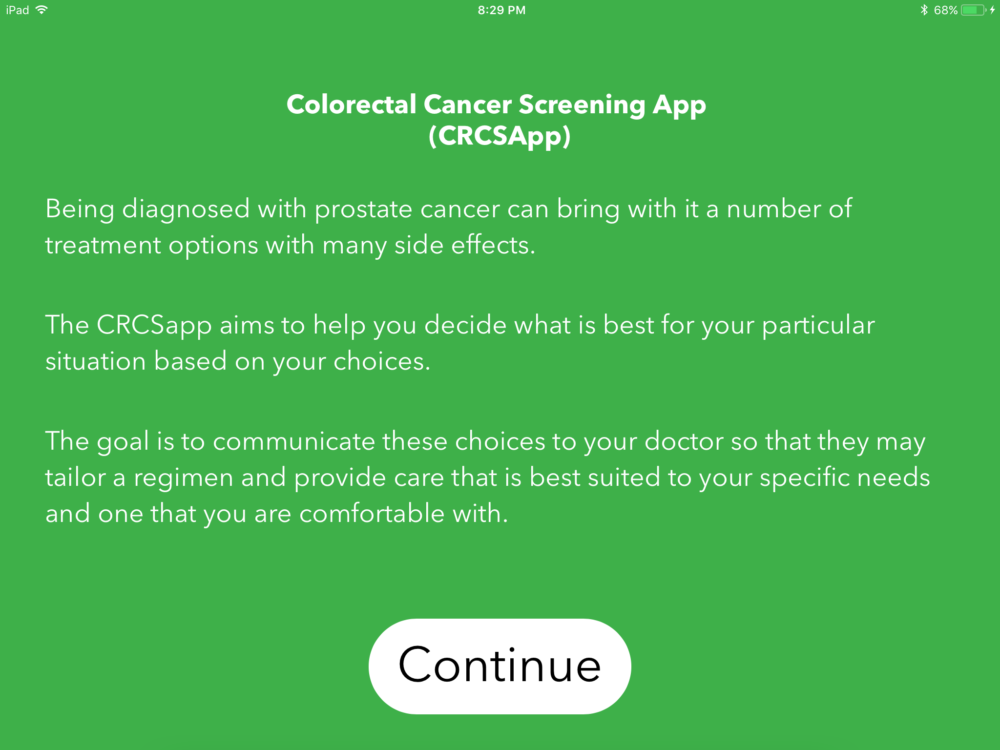
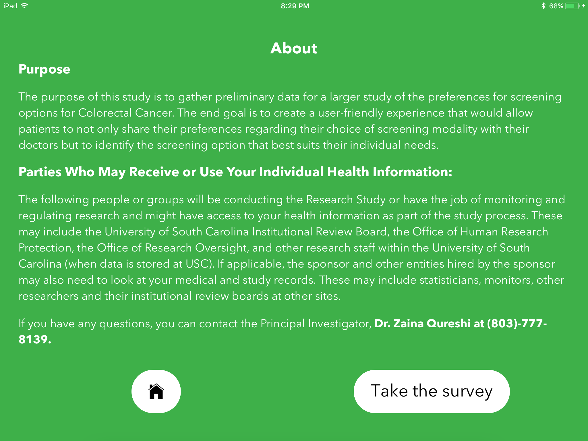
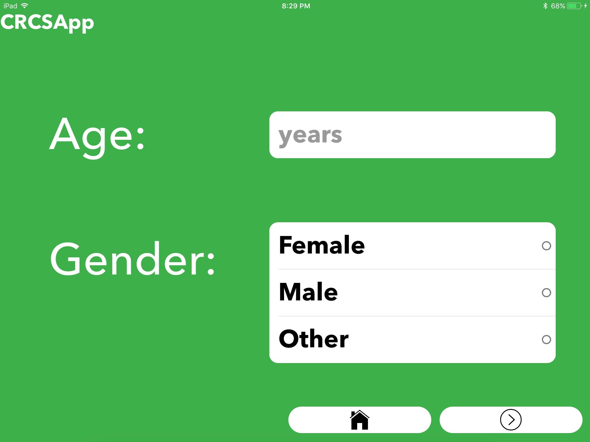
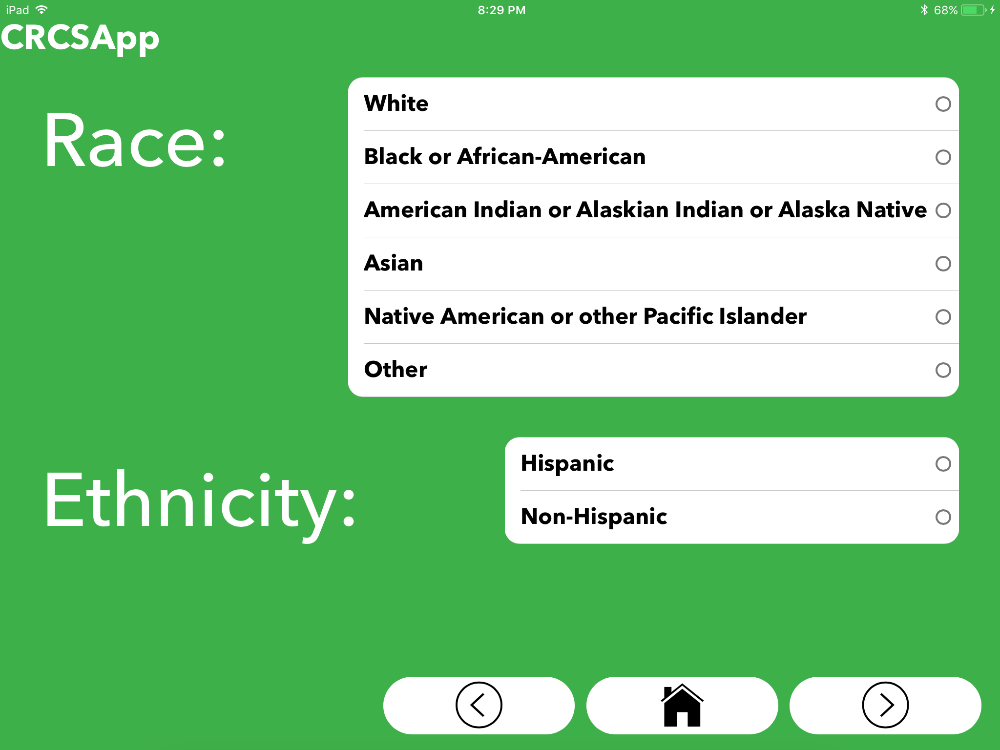
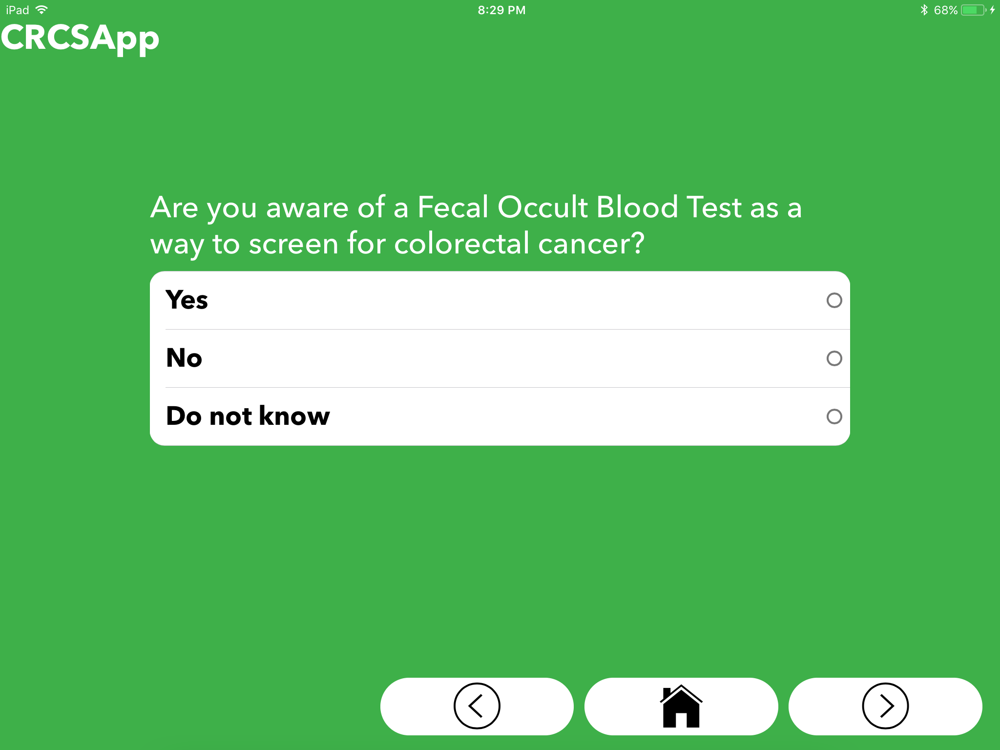
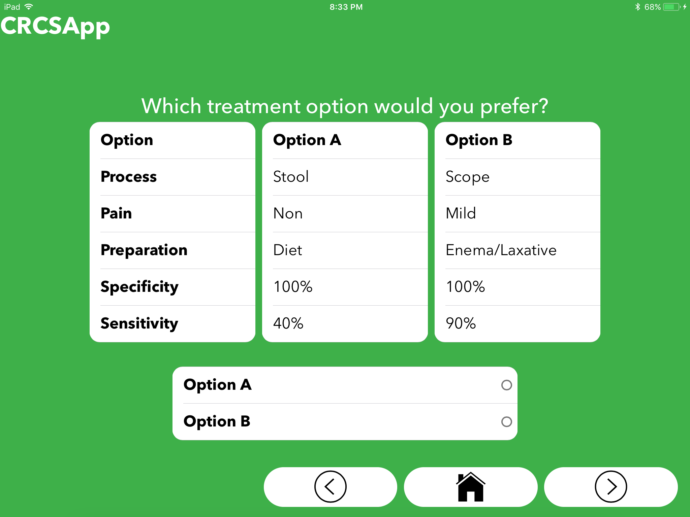

This is an Ionic v2 Application prototype I built under Dr.Bakos @ UofSC for a National Science Foundation proposal by an assistant professor, Zaina Qureshi. 

The purpose of this prototype application was to design the best app interface for elderly Veterans Affair patients. There were specific design guidlines that needed to be followed to be approved as health care application. As a result all aspects of design were taken into account for the most east of use for the expected user.Note that the application was built in mind for use on a 12 inch iPad Pro.

The prototype has been submitted along side an NSF proposal in hopes to recieve funding to move into the next state of the application. 


My favorite design aspect was the shade of blue I picked out. It looked great behind a white slim Avenir Next font.

First download and then from CLI: 

```bash
$ionic serve
```

#### Some sample screenshots:






